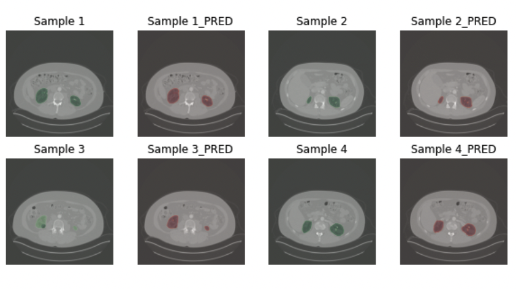

# KiTs21   
(updated: Kits20 > 21)  
Kidney Tumor Segmentation, Abdomen ct scan 중 Kidney 와 Tumor, Cyst segmentation을 진행합니다.  
알고리즘은 2D Unet을 적용하여 진행하였습니다.  
[Chellenge Site : KiTs21](https://kits21.kits-challenge.org/)

## KiTs21 Data Info  
- Data Format : nii.gz  
- Image  
    1. Imaging : patients' abdomen ct scan
- Labels
    1. Multiclass Labels
        1. Aggregated_AND_seg : A voxel-wise "and" or "intersection" operator
        2. Aggregated_OR_seg : A voxel-wise "or" or "union" operator
        3. Aggreagted_MAJ_seg : Voxel-wise majority voting
    2. Instance Labels
        1. Kidney_instance-1_annotation (1~3) : Each instance was annotated by three independent people
        2. Kidney_instance-2_annotation (1~3) : Each instance was annotated by three independent people
        3. Tumor_instance_annotation : Instance Labeling of Tumor

## Model
- Performance
    2D UNET Dice Coefficient : 0.98
    
    
